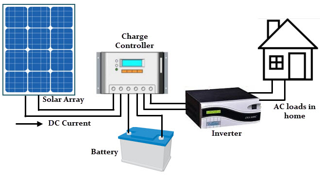

# Enhancing PV Grid Management Through AC-Power Prediction

## Project Descrption

- Solar energy generation is rapidly emerging as one of the most promising and fastest-growing renewable sources of power worldwide. With the increasing demand for electrical energy in our daily lives, photovoltaic (PV) cells have become a key player in meeting these needs. PV cells, semiconductor devices, directly convert sunlight energy into electricity through the photovoltaic effect.

- A single solar cell, measuring 4 cm2, produces a voltage of 0.5 to 1 V and can generate 0.7W of power when exposed to sunlight. The most efficiently designed solar panels typically achieve a maximum efficiency of 25%. To enhance voltage and power generation, individual cells are interconnected, with some connected in series and others in parallel.

  

- PV modules are created by connecting numerous solar cells, and these modules are further linked to form a PV array suitable for applications ranging from small-scale to high-power generation. In a Solar Energy Generating System (SEGS) displayed above, solar panels convert solar energy into Direct Current (DC). This DC is then routed through an inverter to transform it into Alternating Current (AC), making it more compatible with transmission through centralized power grids.

## Dataset Source

This data has been gathered at two solar power plants in India over a 34 day period. It has two pairs of files - each pair has one power generation dataset and one sensor readings dataset. The power generation datasets are gathered at the inverter level - each inverter has multiple lines of solar panels attached to it. The sensor data is gathered at a plant level - single array of sensors optimally placed at the plant.

Dataset Kaggle Link : https://www.kaggle.com/datasets/anikannal/solar-power-generation-data/data?select=Plant_2_Generation_Data.csv

## Goal

- Analyzing the potential AC-Power generated in next couple of days for better grid management.

- Identify the need for panel cleaning/maintenance through sensor and inverter data.